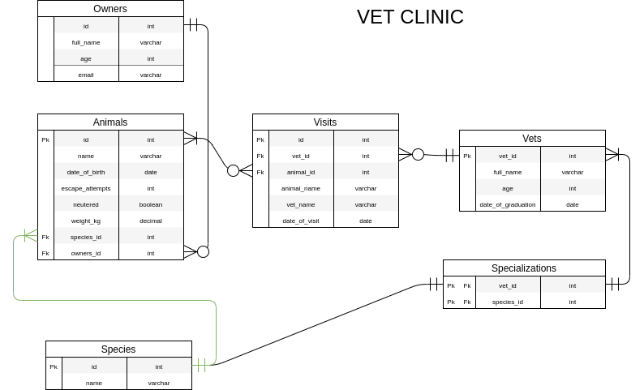

# Vet clinic database
Build a relational database based on a real-life example.

# Database Schema

## Database optimization

To test the optimization of the databse by creating Indexes we get the following results: 

#### - 1 Test

explain analyze SELECT COUNT(*) FROM visits where animal_id = 4;

CREATE INDEX animal_id ON visits (animal_id ASC);

explain analyze SELECT COUNT(*) FROM visits where animal_id = 4;

#### - 2 Test

explain analyze SELECT * FROM visits where vet_id = 2;

CREATE INDEX vets_id ON visits (vet_id ASC);

explain analyze SELECT * FROM visits where vet_id = 2;

#### - 2 Test

explain analyze SELECT * FROM owners where email = 'owner_18327@mail.com';

CREATE INDEX owners_mail  ON owners (email ASC);

explain analyze SELECT * FROM owners where email = 'owner_18327@mail.com';

## Authors

👤 **Abraham Rodriguez**

- GitHub: [@metsanpeitto](https://github.com/Metsanpeitto)
- Twitter: [@metsanpeitto](https://twitter.com/home)
- LinkedIn: [Abraham Rodriguez](https://www.linkedin.com/in/abraham-rodriguez-3283a319a/)
- Portfolio: [Waldenberg](https://portfolio.waldenberginc.com)

👤 NGANULO RUSHANIKA Moise

- GitHub: [@githubhandle](https://github.com/moise10r)
- Twitter: [@twitterhandle](https://twitter.com/MRushanika)
- LinkedIn: [LinkedIn](https://www.linkedin.com/in/nganulo-rushanika-mo%C3%AFse-626139197/)

## 🤝 Contributing

Contributions, issues, and feature requests are welcome!

Feel free to check the [issues page](../../issues/).

## Show your support

Give a ⭐️ if you like this project!

## Acknowledgments

- Microverse for giving me this chance
- The amazing code reviewers for making me improve every day :thumbsup:

## 📝 License

This project is [MIT](./MIT.md) licensed.

